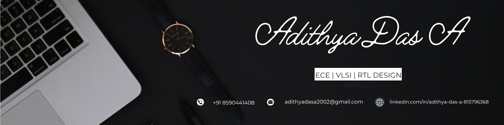

  

<h1 align="center">Hi, I'm Adithya Das A </h1>

<h3 align="center">Electronics & Communication Engineer | VLSI | RTL Design</h3>

---

## About Me

I'm a 2026 B.Tech graduate in Electronics and Communication Engineering
from College of Engineering Chengannur.

I'm interested in **VLSI, RTL Design, Digital Design, Verilog and FPGA-based systems**.

Currently undergoing VLSI/RTL training at **TXR Academy**.

---

## Technical Skills

- Verilog HDL
- RTL Design
- Digital Logic Design
- FSM Design
- Combinational & Sequential Circuits
- Testbench Development
- Xilinx Vivado
- MATLAB
- Proteus
- Python (Basics)
- FPGA Development
- Arduino & ESP32
- Raspberry Pi

---

## Projects

### 🔹 FPGA & RTL Projects

- UART Communication
- SPI Communication
- I2C Communication
- Digital Counter
- FSM-based RTL Designs

### 🔹 Vision-Aid – Wearable Assistive Device

Raspberry Pi 5 based assistive system for obstacle detection
and face recognition.

### 🔹 Automatic Current Limiting & Protection System

Microcontroller-based system for real-time current monitoring,
overload control and relay protection.

### 🔹 TB Detection Using MATLAB

Image-processing based tuberculosis detection from chest X-ray images.

---

Education

**B.Tech – Electronics and Communication Engineering**  
College of Engineering Chengannur  
CGPA: **6.83**

**Diploma – Electronics and Communication Engineering**  
NSS Polytechnic College, Pandalam  
CGPA: **8.19**

---

Certification

- NPTEL – System Design Through Verilog

---

##Connect With Me

 **Email:** adithyadasa2002@gmail.com

 **LinkedIn:** [Adithya Das A](https://www.linkedin.com/in/adithya-das-a-815796368/)

 **GitHub:** [adithyadasa2002](https://github.com/adithyadasa2002)